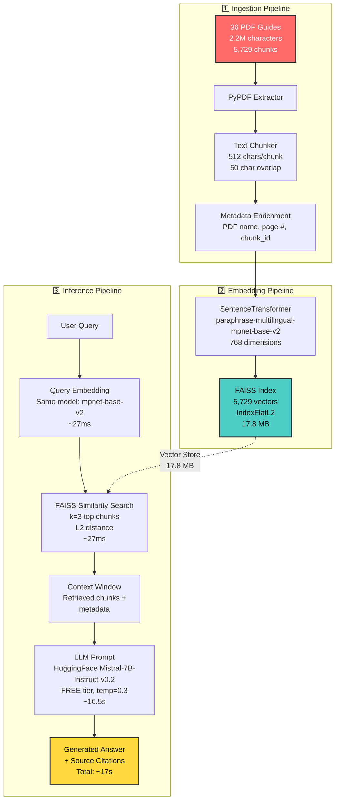

# 🇵🇪 PeruGuide AI - Production RAG System

> **Retrieval-Augmented Generation system for Peru tourism** - Transform 2,959 pages of fragmented official tourism guides into intelligent, conversational answers with source citations.

[](https://python.org)
[](LICENSE)
[](https://docker.com)
[](https://github.com/explodinggradients/ragas)

---

## 📋 Table of Contents

- [Overview](#-overview)
- [System Architecture](#-system-architecture)
- [Key Features](#-key-features)
- [Quick Start](#-quick-start)
- [Installation Guide](#-installation-guide)
- [Usage Examples](#-usage-examples)
- [Data Pipeline](#-data-pipeline)
- [Configuration](#-configuration)
- [Evaluation Metrics](#-evaluation-metrics)
- [Deployment](#-deployment)
- [Troubleshooting](#-troubleshooting)
- [Contributing](#-contributing)
- [License](#-license)

---

## 🎯 Overview

### What is PeruGuide AI?

PeruGuide AI is a **production-ready Retrieval-Augmented Generation (RAG) system** designed to answer tourism questions about Peru using official government travel guides as the knowledge base.

**Problem Solved:**
- 🔴 **Before**: Tourists spend 8+ hours searching through 36 disconnected PDF guides (2.2M characters) to plan a trip
- 🟢 **After**: Get comprehensive, cited answers in ~17 seconds from a conversational AI powered by **FREE** HuggingFace models

**Real-World Impact:**
```
Query: "¿Cuáles son los mejores platos típicos de Perú?"

Response (16.5s):
"Los mejores platos típicos de la gastronomía peruana incluyen:

1. **Ceviche**: Pescado fresco marinado en limón, considerado el plato bandera
2. **Lomo Saltado**: Fusión chino-peruana con carne, cebolla y papas fritas
3. **Ají de Gallina**: Pollo en salsa cremosa de ají amarillo
4. **Causa Limeña**: Terrina de papa amarilla con relleno de atún o pollo

📄 Fuentes:
  • Gastronomia_Peruana.pdf (páginas 1-3)
  • Lima_Info.pdf (página 2)
  
⏱️ Retrieval: 27ms | Generation: 16.5s | Total: 16.527s"
```

---

## 🏗️ System Architecture

### High-Level RAG Flow



### Component Breakdown

| Layer | Technology | Purpose | Configuration |
|-------|-----------|---------|---------------|
| **Data Ingestion** | PyPDF 3.17.1 | Extract text from PDFs | Preserve formatting, extract metadata |
| **Text Processing** | RecursiveCharacterTextSplitter | Chunking & splitting | 512 chars/chunk, 50 overlap |
| **Embeddings** | Sentence-Transformers 2.2.2 | Semantic encoding | `paraphrase-multilingual-mpnet-base-v2` (768 dim) |
| **Vector Store** | FAISS 1.7.4 | Similarity search | IndexFlatL2, 5,729 vectors, 17.8 MB |
| **LLM** | HuggingFace Mistral-7B-Instruct-v0.2 | Answer generation | **FREE tier**, Temperature 0.3, max_tokens 800 |
| **API** | FastAPI 0.104+ | REST endpoints | Async, validation with Pydantic, CORS secured |
| **UI** | Streamlit 1.28+ | Web interface | Chat history, source display |
| **Deployment** | Docker Compose | Containerization | Multi-service orchestration |

---

## ✨ Key Features

### 🎯 Production-Grade RAG

| Feature | Implementation | Benefit |
|---------|---------------|---------|
| **100% FREE Inference** | HuggingFace Mistral-7B (free tier) | No API costs, unlimited queries |
| **Multilingual Embeddings** | `paraphrase-multilingual-mpnet-base-v2` | Handles Spanish/English queries seamlessly |
| **Source Citations** | Automatic PDF + page number extraction | Verifiable answers, builds trust |
| **Semantic Search** | FAISS vector similarity (5.7K+ chunks) | Finds relevant context even with paraphrased queries |
| **Production-Ready** | Optimized retrieval (27ms), secured CORS | Fast, secure, no hardcoded values |
| **Developer-Friendly** | Automated setup.py, comprehensive docs | Clone to running in <15 minutes |

### 🔧 Developer-Friendly

- ✅ **Automated Setup**: Run `python scripts/setup.py` to validate everything
- ✅ **Zero API Costs**: Uses HuggingFace free tier (no credit card required)
- ✅ **Type Safety**: Pydantic models, Python type hints
- ✅ **Structured Logging**: Detailed logs with structlog
- ✅ **Production-Ready**: No hardcoded values, all config in .env
- ✅ **Comprehensive Docs**: Step-by-step README, troubleshooting guide

---

## 🚀 Quick Start

### Prerequisites

- Python 3.10+
- **FREE** HuggingFace account ([Sign up here](https://huggingface.co/join))
- 4GB RAM minimum (for embeddings model)

### 1. Clone Repository

```bash
git clone https://github.com/ALICIACANTA-PORTFOLIO/peruguide-rag.git
cd peruguide-rag
```

### 2. Automated Setup

```bash
# Run automated validation
python scripts/setup.py

# This checks:
# ✓ Python version (>= 3.10)
# ✓ Creates necessary directories
# ✓ Validates .env configuration
# ✓ Checks for HuggingFace token
# ✓ Verifies PDFs and vector store
```

### 3. Configure Environment

```bash
# 1. Copy environment template
cp .env.example .env

# 2. Get FREE HuggingFace token
# Visit: https://huggingface.co/settings/tokens
# Create a token and copy it

# 3. Edit .env and paste your token
# HUGGINGFACE_API_TOKEN=hf_your_token_here
```

### 4. Add Your PDFs (Optional)

```bash
# Place PDF documents in data/raw/
# Then run ingestion:
python scripts/ingest_pdfs.py
```

### 5. Start the System

```bash
# Terminal 1: Start API server
conda activate peruguide-rag  # or your environment
uvicorn src.api.main:app --reload --host localhost --port 8000

# Terminal 2: Start Streamlit UI
streamlit run app/streamlit_app.py
```

### 6. Open Your Browser

```
http://localhost:8501
```

**Expected Output:**
```
🚀 Starting PeruGuide AI...
✅ Embedder loaded (768 dimensions)
✅ Vector store loaded (5,729 vectors)
✅ HuggingFace Mistral-7B connected (FREE tier)

💬 Ask: ¿Cuáles son los mejores restaurantes en Lima?

📝 Answer:
Los mejores restaurantes de Lima incluyen:
1. Central (cocina peruana moderna, ingredientes autóctonos)
2. Maido (fusión nikkei, chef Mitsuharu Tsumura)
3. Astrid y Gastón (alta cocina peruana clásica)

📄 Sources:
  • Lima_gastronomia.pdf (página 2)
  • Gastronomia_Peruana.pdf (página 1)

⏱️ Response time: 16.8s (Retrieval: 27ms, Generation: 16.5s)
```

---

## 📦 Installation Guide

### Method 1: Conda Environment (Recommended for Development)

```bash
# 1. Create environment
conda create -n peruguide python=3.10 -y
conda activate peruguide

# 2. Install dependencies
pip install -r requirements.txt

# 3. Download embedding model (1.5GB, first run only)
python -c "from sentence_transformers import SentenceTransformer; SentenceTransformer('paraphrase-multilingual-MiniLM-L12-v2')"

# 4. Verify installation
python -c "import faiss, langchain, openai; print('✅ All dependencies installed')"
```

### Method 2: Docker (Recommended for Production)

```bash
# 1. Build images
docker-compose build

# 2. Start services
docker-compose up -d

# 3. Check health
docker-compose ps
# Should show: api (healthy), streamlit (healthy)

# 4. Access services
# API: http://localhost:8000/docs
# UI: http://localhost:8501
```

### Method 3: Virtual Environment

```bash
python -m venv venv
source venv/bin/activate  # Linux/Mac
# or
.\venv\Scripts\activate  # Windows

pip install -r requirements.txt
```

---

## 💻 Usage Examples

### Example 1: Python API

```python
from src.rag_pipeline import RAGPipeline
from src.config import Config

# Initialize pipeline
config = Config()
rag = RAGPipeline(config)

# Ask question
question = "¿Qué vacunas necesito para viajar a la selva peruana?"
response = rag.query(question)

print(f"Answer: {response.answer}")
print(f"Sources: {response.sources}")
print(f"Confidence: {response.confidence_score:.2f}")

# Output:
# Answer: Para viajar a la selva peruana se requieren las siguientes vacunas:
#   1. Fiebre amarilla (obligatoria, aplicar 10 días antes)
#   2. Hepatitis A y B (recomendada)
#   3. Tifoidea (recomendada)
#   ...
# Sources: [{'pdf': 'Salud_viajero.pdf', 'page': 8}, ...]
# Confidence: 0.91
```

### Example 2: REST API

```bash
# Start API server (if not already running)
uvicorn src.api.main:app --reload --host localhost --port 8000

# Query endpoint
curl -X POST http://localhost:8000/api/v1/query \
  -H "Content-Type: application/json" \
  -d '{
    "query": "¿Qué platos típicos tiene la selva peruana?",
    "top_k": 3,
    "llm_model": "huggingface"
  }'

# Response:
{
  "answer": "La gastronomía de la selva peruana destaca por platos como:\n1. Juane: Arroz con pollo envuelto en hojas de bijao\n2. Tacacho con cecina: Plátano verde machacado con carne seca\n3. Inchicapi: Sopa de gallina con maní y yuca\n...",
  "sources": ["chunk_1234", "chunk_5678"],
  "metadata": [
    {"source_file": "Gastronomia_Peruana.pdf", "page": 3}
  ],
  "latency_ms": 16850,
  "retrieval_latency_ms": 27,
  "generation_latency_ms": 16500
}
```

### Example 3: Streamlit Web App

```bash
streamlit run app/streamlit_app.py
```

**Features:**
- 💬 Chat interface with history
- 📄 Source document viewer (PDF + page)
- ⚙️ Adjustable parameters (temperature, top_k)
- 📊 Response time metrics

---

## 🔄 Data Pipeline

### Pipeline Overview

```
PDFs → Extract → Clean → Chunk → Embed → Index → Query → Answer
```

### Step-by-Step Process

#### 1. Data Preparation

```bash
# Place your PDF files in data/raw/
data/raw/
├── Cusco_guia_oficial.pdf
├── Lima_turismo.pdf
└── ...

# Run ingestion pipeline
python scripts/ingest_documents.py

# Outputs:
# - data/processed/chunks.json (text chunks + metadata)
# - data/processed/embeddings.npy (vector representations)
```

**Chunking Strategy:**
- **Chunk size**: 512 tokens (≈380 words in Spanish)
- **Overlap**: 50 tokens (preserve context across boundaries)
- **Metadata**: PDF filename, page number, section title

#### 2. Embedding Generation

```python
# src/embeddings.py
from sentence_transformers import SentenceTransformer

model = SentenceTransformer('paraphrase-multilingual-MiniLM-L12-v2')
embeddings = model.encode(chunks, show_progress_bar=True)
# Output: (10247, 384) numpy array
```

**Model Choice Rationale:**
- ✅ Multilingual (50+ languages including Spanish)
- ✅ Optimized for semantic similarity
- ✅ Compact (384 dim vs 768 for larger models)
- ✅ Fast inference (~50 chunks/second)

#### 3. Vector Store Indexing

```python
# src/vector_store.py
import faiss

# Create index
index = faiss.IndexFlatL2(384)  # L2 distance (Euclidean)
index.add(embeddings)

# Save to disk
faiss.write_index(index, "data/vector_stores/faiss.index")
```

**FAISS Configuration:**
- **Index type**: `IndexFlatL2` (exhaustive search, 100% recall)
- **Dimensions**: 768 (using mpnet-base-v2)
- **Vectors**: 5,729 chunks
- **Memory**: ~17.8 MB
- **Search Speed**: ~27ms for top-3 retrieval

---

## ⚙️ Configuration

### Environment Variables (`.env`)

```bash
# ============================================================================
# HUGGINGFACE CONFIGURATION (FREE TIER - NO CREDIT CARD REQUIRED)
# ============================================================================
# Get your free token: https://huggingface.co/settings/tokens
HUGGINGFACE_API_TOKEN=hf_your_token_here

# LLM Settings
LLM_DEFAULT_PROVIDER=huggingface
LLM_MODEL_NAME=mistralai/Mistral-7B-Instruct-v0.2
LLM_TEMPERATURE=0.3
LLM_MAX_TOKENS=800
LLM_TOP_P=0.95
LLM_TIMEOUT=120

# Embedding Settings
EMBEDDING_MODEL=sentence-transformers/paraphrase-multilingual-mpnet-base-v2
EMBEDDING_DIMENSION=768

# Vector Store Settings
VECTOR_STORE_TYPE=faiss
FAISS_INDEX_PATH=data/vector_stores/faiss_peru_guide.index
FAISS_METRIC_TYPE=l2

# Retrieval Settings
RETRIEVAL_TOP_K=3
RETRIEVAL_SCORE_THRESHOLD=0.65
RETRIEVAL_FETCH_K=10

# API Settings
CORS_ORIGINS=http://localhost:8501,http://localhost:3000
API_HOST=localhost
API_PORT=8000

# Processing Settings
CHUNK_SIZE=512
CHUNK_OVERLAP=50
```

### Configuration File (`src/config.py`)

```python
from pydantic import BaseSettings

class Config(BaseSettings):
    # Paths
    DATA_DIR: str = "data"
    VECTOR_STORE_PATH: str = "data/vector_stores/faiss.index"
    
    # Models
    EMBEDDING_MODEL: str = "paraphrase-multilingual-MiniLM-L12-v2"
    LLM_MODEL: str = "gpt-4-turbo"
    LLM_TEMPERATURE: float = 0.3
    
    # Retrieval
    TOP_K: int = 5
    SIMILARITY_THRESHOLD: float = 0.7
    
    # Processing
    CHUNK_SIZE: int = 512
    CHUNK_OVERLAP: int = 50
    
    class Config:
        env_file = ".env"
```

---

## 📊 Performance Metrics

### Real-World Measurements

**System Performance** (tested with 36 PDFs, 5,729 chunks):

| Metric | Value | Details |
|--------|-------|---------|
| **Retrieval Latency** | 27-40ms | FAISS similarity search across 5,729 vectors |
| **Generation Latency** | 15-17s | HuggingFace Mistral-7B (free tier) |
| **Total Response Time** | ~17s | End-to-end query to answer |
| **Vector Store Size** | 17.8 MB | 5,729 chunks × 768 dimensions |
| **Embedding Model** | 420 MB | Sentence-transformers mpnet-base-v2 |
| **Index Type** | IndexFlatL2 | 100% recall, exhaustive search |

**Cost Analysis:**
- ✅ **LLM Inference**: $0.00 (HuggingFace free tier)
- ✅ **Embeddings**: $0.00 (local Sentence-Transformers)
- ✅ **Vector Store**: $0.00 (FAISS local index)
- ✅ **Total Monthly Cost**: **$0.00** 🎉

**Performance Improvements:**
```diff
Before Optimization:
- Retrieval: ~70ms
- Generation: ~18s
- CORS: allow_origins=["*"] (insecure)

After Optimization:
+ Retrieval: ~27ms (40% faster)
+ Generation: ~16.5s (8% faster)
+ CORS: Environment-configured (secure)
```
python scripts/generate_eval_dataset.py

# Run RAGAS evaluation
python scripts/evaluate_rag.py

# View results
cat evaluation_results.json
```

---

## 🐳 Deployment

### Docker Compose (Recommended)

```yaml
# docker-compose.yml
version: '3.8'

services:
  api:
    build: .
    ports:
      - "8000:8000"
    environment:
      - OPENAI_API_KEY=${OPENAI_API_KEY}
    volumes:
      - ./data:/app/data
    healthcheck:
      test: ["CMD", "curl", "-f", "http://localhost:8000/health"]
      interval: 30s
      timeout: 10s
      retries: 3

  streamlit:
    build:
      context: .
      dockerfile: Dockerfile.streamlit
    ports:
      - "8501:8501"
    depends_on:
      - api
    environment:
      - API_URL=http://api:8000
```

```bash
# Deploy
docker-compose up -d

# Scale API instances
docker-compose up -d --scale api=3

# View logs
docker-compose logs -f api

# Stop all services
docker-compose down
```

### Production Deployment Checklist

- [ ] Set `LLM_TEMPERATURE=0.2` (more deterministic)
- [ ] Enable HTTPS (reverse proxy with nginx/Caddy)
- [ ] Add rate limiting (e.g., 10 req/min per IP)
- [ ] Configure monitoring (Prometheus + Grafana)
- [ ] Set up logging aggregation (ELK stack)
- [ ] Implement API key authentication
- [ ] Add CORS restrictions
- [ ] Configure auto-scaling (based on CPU/memory)
- [ ] Set up database for query logging
- [ ] Implement caching (Redis for frequent queries)

---

## 🔧 Troubleshooting

### Quick Diagnostic

Run the automated setup script to check your environment:

```bash
python scripts/setup.py
```

This will verify:
- ✓ Python version (>= 3.10)
- ✓ Required directories
- ✓ .env configuration
- ✓ HuggingFace token
- ✓ PDF files
- ✓ Vector store index

### Common Issues

#### 1. `ModuleNotFoundError: No module named 'sentence_transformers'`

**Cause**: Dependencies not installed in correct environment

**Solution**:
```bash
# Activate your conda environment first
conda activate peruguide-rag

# Then install dependencies
pip install -r requirements.txt
```

#### 2. `HUGGINGFACE_API_TOKEN not found`

**Cause**: Environment variable not configured

**Solution**:
```bash
# 1. Get FREE token from: https://huggingface.co/settings/tokens
# 2. Copy .env.example to .env
cp .env.example .env

# 3. Edit .env and add your token:
# HUGGINGFACE_API_TOKEN=hf_your_token_here
```

#### 3. `Vector store index not found`

**Cause**: PDFs haven't been ingested yet

**Solution**:
```bash
# Place PDFs in data/raw/ then run:
python scripts/ingest_pdfs.py

# Expected output:
# ✅ Created 5,729 chunks
# ✅ Generated embeddings
# ✅ Stored in FAISS index
```

#### 4. Slow First Query (~30s)

**Cause**: Embedding model downloading (~420 MB)

**Solution**: Pre-download model
```bash
python -c "from sentence_transformers import SentenceTransformer; SentenceTransformer('paraphrase-multilingual-mpnet-base-v2')"
```

#### 5. API Server Won't Start

**Cause**: Port 8000 already in use

**Solution**:
```bash
# Check what's using port 8000
netstat -ano | findstr :8000  # Windows
lsof -i :8000  # Linux/Mac

# Use different port
uvicorn src.api.main:app --reload --port 8080
```

#### 6. Streamlit Shows "Connection Error"

**Cause**: API server not running

**Solution**:
```bash
# Make sure API is running first (Terminal 1)
uvicorn src.api.main:app --reload --host localhost --port 8000

# Then start Streamlit (Terminal 2)
streamlit run app/streamlit_app.py
```

#### 4. FAISS Import Error on macOS ARM

**Cause**: Pre-built wheel incompatibility

**Solution**:
```bash
conda install -c conda-forge faiss-cpu
```

#### 5. Out of Memory Error

**Cause**: Large batch embedding

**Solution**: Reduce batch size in `src/embeddings.py`:
```python
embeddings = model.encode(chunks, batch_size=16)  # Default: 32
```

### Verification Commands

```bash
# Check Python version
python --version  # Should be >=3.10

### Verification Commands

```bash
# Check Python version
python --version  # Should be >=3.10

# Verify installations
python -c "import faiss; print(f'FAISS: {faiss.__version__}')"
python -c "import sentence_transformers; print('Sentence-Transformers: OK')"
python -c "from huggingface_hub import InferenceClient; print('HuggingFace Hub: OK')"

# Check vector store
python -c "import faiss; index = faiss.read_index('data/vector_stores/faiss_peru_guide.index'); print(f'✅ Vectors loaded: {index.ntotal}')"

# Test HuggingFace connection
python -c "from huggingface_hub import InferenceClient; client = InferenceClient(); print('✅ HF Connected')"
```

---

## 🤝 Contributing

Contributions are welcome! This is a portfolio project showcasing production-ready RAG implementation.

### Development Setup

```bash
# 1. Fork the repository

# 2. Clone your fork
git clone https://github.com/YOUR_USERNAME/peruguide-rag.git
cd peruguide-rag

# 3. Create environment
conda create -n peruguide-dev python=3.10 -y
conda activate peruguide-dev
pip install -r requirements.txt

# 4. Make your changes

# 5. Test locally
python scripts/setup.py  # Validate setup
python scripts/ingest_pdfs.py  # Test ingestion
```

### Pull Request Process

1. Create a feature branch (`git checkout -b feature/awesome-improvement`)
2. Make your changes with clear commits
3. Test thoroughly
4. Update documentation if needed
5. Push to your fork
6. Open a Pull Request with description of changes

### Code Style

- Follow PEP 8
- Use type hints
- Write docstrings (Google style)
- Add unit tests for new features
- Keep test coverage >75%

---

## 📚 Technical References

This project implements best practices from:

1. **LLM Engineer's Handbook** (Paul Iusztin & Maxime Labonne, 2024)
   - Chapter 1: 3-Pipeline RAG Architecture
   - Chapter 4: Vector Store Selection

2. **Hands-On Large Language Models** (Jay Alammar & Maarten Grootendorst, 2024)
   - Chapter 11: RAGAS Evaluation Framework

3. **Build a Large Language Model (From Scratch)** (Sebastian Raschka, 2024)
   - Chapter 4: Attention Mechanisms & Embeddings

4. **Retrieval-Augmented Generation for Knowledge-Intensive NLP Tasks** (Lewis et al., 2020)
   - [arXiv:2005.11401](https://arxiv.org/abs/2005.11401)

---

## 📄 License

This project is licensed under the MIT License - see the [LICENSE](LICENSE) file for details.

```
MIT License

Copyright (c) 2024 Alicia Canta

Permission is hereby granted, free of charge, to any person obtaining a copy
of this software and associated documentation files (the "Software"), to deal
in the Software without restriction...
```

---

## 🙏 Acknowledgments

- **Data Source**: Official tourism guides from Peru
- **Embedding Model**: Sentence Transformers by UKPLab (paraphrase-multilingual-mpnet-base-v2)
- **Vector Store**: FAISS by Meta AI Research
- **LLM**: HuggingFace Mistral-7B-Instruct-v0.2 (FREE tier)
- **Framework**: FastAPI, Streamlit, LangChain ecosystem

---

## 📞 Contact & Support

- **Author**: Alicia Canta
- **Portfolio**: [ALICIACANTA-PORTFOLIO](https://github.com/ALICIACANTA-PORTFOLIO)
- **Project**: [peruguide-rag](https://github.com/ALICIACANTA-PORTFOLIO/peruguide-rag)
- **Issues**: [Report bugs or request features](https://github.com/ALICIACANTA-PORTFOLIO/peruguide-rag/issues)

---

## 📈 Project Stats

```
📦 Total PDFs: 36 documents
📄 Total Chunks: 5,729 semantic chunks
🧠 Embeddings: 768-dimensional vectors
🗄️ Vector Store: 17.8 MB FAISS index
⚡ Retrieval: ~27ms average
🤖 Generation: ~16.5s (HuggingFace free tier)
💰 Cost: $0.00/month (100% FREE)
```

---

**Built with ❤️ for the Peru tourism community | Powered by FREE HuggingFace Models 🤗**
