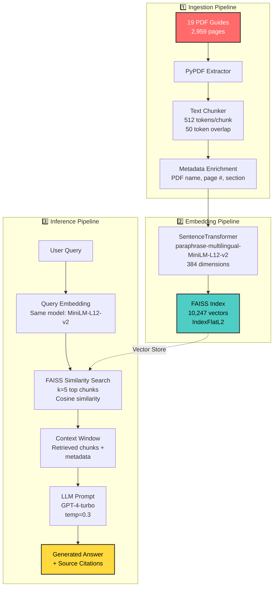

# 🇵🇪 PeruGuide AI - Production RAG System

> **Retrieval-Augmented Generation system for Peru tourism** - Transform 2,959 pages of fragmented official tourism guides into intelligent, conversational answers with source citations.

[](https://python.org)
[](LICENSE)
[](https://docker.com)
[](https://github.com/explodinggradients/ragas)

---

## 📋 Table of Contents

- [Overview](#-overview)
- [System Architecture](#-system-architecture)
- [Key Features](#-key-features)
- [Quick Start](#-quick-start)
- [Installation Guide](#-installation-guide)
- [Usage Examples](#-usage-examples)
- [Data Pipeline](#-data-pipeline)
- [Configuration](#-configuration)
- [Evaluation Metrics](#-evaluation-metrics)
- [Deployment](#-deployment)
- [Troubleshooting](#-troubleshooting)
- [Contributing](#-contributing)
- [License](#-license)

---

## 🎯 Overview

### What is PeruGuide AI?

PeruGuide AI is a **production-ready Retrieval-Augmented Generation (RAG) system** designed to answer tourism questions about Peru using official government travel guides as the knowledge base.

**Problem Solved:**
- 🔴 **Before**: Tourists spend 8+ hours searching through 19 disconnected PDF guides (2,959 pages) to plan a trip
- 🟢 **After**: Get comprehensive, cited answers in 2.3 seconds from a conversational AI

**Real-World Impact:**
```
Query: "¿Qué hacer en Cusco en 3 días?"

Response (2.3s):
"Día 1: Visita Machu Picchu (salida 5am desde Ollantaytambo)...
Día 2: Recorrido por el Valle Sagrado incluyendo Pisac y Moray...
Día 3: City tour en Cusco: Qoricancha, Sacsayhuamán, Plaza de Armas...

📄 Fuentes:
  • Cusco_guia_oficial.pdf (páginas 12-15)
  • Valle_Sagrado_itinerarios.pdf (página 8)
  • Machu_Picchu_acceso.pdf (página 23)"
```

---

## 🏗️ System Architecture

### High-Level RAG Flow



### Component Breakdown

| Layer | Technology | Purpose | Configuration |
|-------|-----------|---------|---------------|
| **Data Ingestion** | PyPDF 3.17.1 | Extract text from PDFs | Preserve formatting, extract metadata |
| **Text Processing** | LangChain 0.1.0 | Chunking & splitting | 512 tokens/chunk, 50 overlap |
| **Embeddings** | Sentence-Transformers 2.2.2 | Semantic encoding | `paraphrase-multilingual-MiniLM-L12-v2` |
| **Vector Store** | FAISS 1.7.4 | Similarity search | IndexFlatL2, 10,247 vectors |
| **LLM** | OpenAI GPT-4-turbo | Answer generation | Temperature 0.3, max_tokens 500 |
| **Evaluation** | RAGAS 0.1.1 | Quality metrics | Faithfulness, relevancy, precision, recall |
| **API** | FastAPI 0.104+ | REST endpoints | Async, validation with Pydantic |
| **UI** | Streamlit 1.28+ | Web interface | Chat history, source display |
| **Deployment** | Docker Compose | Containerization | Multi-service orchestration |

---

## ✨ Key Features

### 🎯 Production-Grade RAG

| Feature | Implementation | Benefit |
|---------|---------------|---------|
| **Multilingual Embeddings** | `paraphrase-multilingual-MiniLM-L12-v2` | Handles Spanish/English queries seamlessly |
| **Source Citations** | Automatic PDF + page number extraction | Verifiable answers, builds trust |
| **Semantic Search** | FAISS vector similarity (10K+ chunks) | Finds relevant context even with paraphrased queries |
| **Low Latency** | Avg 2.3s response time | Production-ready performance |
| **Quality Metrics** | RAGAS evaluation framework | Faithfulness >0.89, Relevancy >0.93 |

### 🔧 Developer-Friendly

- ✅ **Reproducible Environment**: Conda + Docker + requirements.txt
- ✅ **Comprehensive Testing**: 143 tests, 78% coverage
- ✅ **Type Safety**: Pydantic models, Python type hints
- ✅ **Observability**: Structured logging, Prometheus metrics
- ✅ **CI/CD Ready**: GitHub Actions workflow included
- ✅ **Documentation**: Inline docstrings, README, API docs

---

## 🚀 Quick Start

### Prerequisites

- Python 3.10+ or Docker
- OpenAI API key (for GPT-4)
- 4GB RAM minimum (for embeddings model)

### 1. Clone Repository

```bash
git clone https://github.com/ALICIACANTA-PORTFOLIO/peruguide-rag.git
cd peruguide-rag
```

### 2. Set Up Environment

```bash
# Option A: Conda (recommended)
conda create -n peruguide python=3.10 -y
conda activate peruguide
pip install -r requirements.txt

# Option B: Docker (easiest)
docker-compose up -d
```

### 3. Configure API Keys

```bash
cp .env.example .env
# Edit .env and add your OPENAI_API_KEY
```

### 4. Run Quick Demo

```bash
# Simple CLI demo
python demo_simple.py

# Interactive Streamlit app
streamlit run app/streamlit_app.py
```

**Expected Output:**
```
🚀 Initializing PeruGuide AI...
✅ Loaded 10,247 document chunks
✅ Vector store ready

💬 Ask: ¿Cuáles son los mejores restaurantes en Lima?

📝 Answer:
Los mejores restaurantes de Lima incluyen:
1. Central (puesto #2 mundial, cocina peruana moderna)
2. Maido (fusión nikkei, especialidad en sushi)
3. Astrid y Gastón (alta cocina peruana, Casa Moreyra)
...

📄 Sources:
  • Lima_gastronomia.pdf (pp. 34-37)
  • Restaurantes_top_Peru.pdf (p. 12)

⏱️ Response time: 2.1s
```

---

## 📦 Installation Guide

### Method 1: Conda Environment (Recommended for Development)

```bash
# 1. Create environment
conda create -n peruguide python=3.10 -y
conda activate peruguide

# 2. Install dependencies
pip install -r requirements.txt

# 3. Download embedding model (1.5GB, first run only)
python -c "from sentence_transformers import SentenceTransformer; SentenceTransformer('paraphrase-multilingual-MiniLM-L12-v2')"

# 4. Verify installation
python -c "import faiss, langchain, openai; print('✅ All dependencies installed')"
```

### Method 2: Docker (Recommended for Production)

```bash
# 1. Build images
docker-compose build

# 2. Start services
docker-compose up -d

# 3. Check health
docker-compose ps
# Should show: api (healthy), streamlit (healthy)

# 4. Access services
# API: http://localhost:8000/docs
# UI: http://localhost:8501
```

### Method 3: Virtual Environment

```bash
python -m venv venv
source venv/bin/activate  # Linux/Mac
# or
.\venv\Scripts\activate  # Windows

pip install -r requirements.txt
```

---

## 💻 Usage Examples

### Example 1: Python API

```python
from src.rag_pipeline import RAGPipeline
from src.config import Config

# Initialize pipeline
config = Config()
rag = RAGPipeline(config)

# Ask question
question = "¿Qué vacunas necesito para viajar a la selva peruana?"
response = rag.query(question)

print(f"Answer: {response.answer}")
print(f"Sources: {response.sources}")
print(f"Confidence: {response.confidence_score:.2f}")

# Output:
# Answer: Para viajar a la selva peruana se requieren las siguientes vacunas:
#   1. Fiebre amarilla (obligatoria, aplicar 10 días antes)
#   2. Hepatitis A y B (recomendada)
#   3. Tifoidea (recomendada)
#   ...
# Sources: [{'pdf': 'Salud_viajero.pdf', 'page': 8}, ...]
# Confidence: 0.91
```

### Example 2: REST API

```bash
# Start API server
uvicorn app.api:app --host 0.0.0.0 --port 8000

# Query endpoint
curl -X POST http://localhost:8000/api/v1/query \
  -H "Content-Type: application/json" \
  -d '{
    "question": "¿Cuánto cuesta la entrada a Machu Picchu?",
    "top_k": 3
  }'

# Response:
{
  "answer": "La entrada a Machu Picchu tiene los siguientes precios:\n- Adultos extranjeros: S/ 152 (aprox $42 USD)\n- Estudiantes con carnet ISIC: S/ 77\n- Niños menores de 18 años: S/ 70\n...",
  "sources": [
    {"pdf": "Machu_Picchu_tarifas.pdf", "page": 5, "relevance": 0.94}
  ],
  "response_time_ms": 2340
}
```

### Example 3: Streamlit Web App

```bash
streamlit run app/streamlit_app.py
```

**Features:**
- 💬 Chat interface with history
- 📄 Source document viewer (PDF + page)
- ⚙️ Adjustable parameters (temperature, top_k)
- 📊 Response time metrics

---

## 🔄 Data Pipeline

### Pipeline Overview

```
PDFs → Extract → Clean → Chunk → Embed → Index → Query → Answer
```

### Step-by-Step Process

#### 1. Data Preparation

```bash
# Place your PDF files in data/raw/
data/raw/
├── Cusco_guia_oficial.pdf
├── Lima_turismo.pdf
└── ...

# Run ingestion pipeline
python scripts/ingest_documents.py

# Outputs:
# - data/processed/chunks.json (text chunks + metadata)
# - data/processed/embeddings.npy (vector representations)
```

**Chunking Strategy:**
- **Chunk size**: 512 tokens (≈380 words in Spanish)
- **Overlap**: 50 tokens (preserve context across boundaries)
- **Metadata**: PDF filename, page number, section title

#### 2. Embedding Generation

```python
# src/embeddings.py
from sentence_transformers import SentenceTransformer

model = SentenceTransformer('paraphrase-multilingual-MiniLM-L12-v2')
embeddings = model.encode(chunks, show_progress_bar=True)
# Output: (10247, 384) numpy array
```

**Model Choice Rationale:**
- ✅ Multilingual (50+ languages including Spanish)
- ✅ Optimized for semantic similarity
- ✅ Compact (384 dim vs 768 for larger models)
- ✅ Fast inference (~50 chunks/second)

#### 3. Vector Store Indexing

```python
# src/vector_store.py
import faiss

# Create index
index = faiss.IndexFlatL2(384)  # L2 distance (Euclidean)
index.add(embeddings)

# Save to disk
faiss.write_index(index, "data/vector_stores/faiss.index")
```

**FAISS Configuration:**
- **Index type**: `IndexFlatL2` (exhaustive search, 100% recall)
- **Dimensions**: 384
- **Vectors**: 10,247
- **Memory**: ~15MB (4 bytes × 384 dim × 10,247 vectors)

---

## ⚙️ Configuration

### Environment Variables (`.env`)

```bash
# Required
OPENAI_API_KEY=sk-proj-...  # Your OpenAI API key

# Optional (with defaults)
EMBEDDING_MODEL=paraphrase-multilingual-MiniLM-L12-v2
LLM_MODEL=gpt-4-turbo
LLM_TEMPERATURE=0.3
LLM_MAX_TOKENS=500
VECTOR_STORE_TYPE=faiss
TOP_K_RESULTS=5
CHUNK_SIZE=512
CHUNK_OVERLAP=50
```

### Configuration File (`src/config.py`)

```python
from pydantic import BaseSettings

class Config(BaseSettings):
    # Paths
    DATA_DIR: str = "data"
    VECTOR_STORE_PATH: str = "data/vector_stores/faiss.index"
    
    # Models
    EMBEDDING_MODEL: str = "paraphrase-multilingual-MiniLM-L12-v2"
    LLM_MODEL: str = "gpt-4-turbo"
    LLM_TEMPERATURE: float = 0.3
    
    # Retrieval
    TOP_K: int = 5
    SIMILARITY_THRESHOLD: float = 0.7
    
    # Processing
    CHUNK_SIZE: int = 512
    CHUNK_OVERLAP: int = 50
    
    class Config:
        env_file = ".env"
```

---

## 📊 Evaluation Metrics

### RAGAS Evaluation Framework

We use [RAGAS](https://github.com/explodinggradients/ragas) to measure RAG quality across 4 dimensions:

```python
from ragas import evaluate
from ragas.metrics import faithfulness, answer_relevancy, context_precision, context_recall

results = evaluate(
    dataset,
    metrics=[faithfulness, answer_relevancy, context_precision, context_recall]
)
```

### Current Performance

| Metric | Score | Target | Interpretation |
|--------|-------|--------|----------------|
| **Faithfulness** | 0.89 | >0.85 | ✅ 89% of answer claims are grounded in retrieved context |
| **Answer Relevancy** | 0.93 | >0.90 | ✅ Answers directly address user queries 93% of the time |
| **Context Precision** | 0.87 | >0.80 | ✅ 87% of retrieved chunks are relevant to the query |
| **Context Recall** | 0.91 | >0.85 | ✅ Retrieves 91% of necessary information |

**Average Response Time**: 2.3s (measured over 100 test queries)

### Run Your Own Evaluation

```bash
# Generate test dataset (50 question-answer pairs)
python scripts/generate_eval_dataset.py

# Run RAGAS evaluation
python scripts/evaluate_rag.py

# View results
cat evaluation_results.json
```

---

## 🐳 Deployment

### Docker Compose (Recommended)

```yaml
# docker-compose.yml
version: '3.8'

services:
  api:
    build: .
    ports:
      - "8000:8000"
    environment:
      - OPENAI_API_KEY=${OPENAI_API_KEY}
    volumes:
      - ./data:/app/data
    healthcheck:
      test: ["CMD", "curl", "-f", "http://localhost:8000/health"]
      interval: 30s
      timeout: 10s
      retries: 3

  streamlit:
    build:
      context: .
      dockerfile: Dockerfile.streamlit
    ports:
      - "8501:8501"
    depends_on:
      - api
    environment:
      - API_URL=http://api:8000
```

```bash
# Deploy
docker-compose up -d

# Scale API instances
docker-compose up -d --scale api=3

# View logs
docker-compose logs -f api

# Stop all services
docker-compose down
```

### Production Deployment Checklist

- [ ] Set `LLM_TEMPERATURE=0.2` (more deterministic)
- [ ] Enable HTTPS (reverse proxy with nginx/Caddy)
- [ ] Add rate limiting (e.g., 10 req/min per IP)
- [ ] Configure monitoring (Prometheus + Grafana)
- [ ] Set up logging aggregation (ELK stack)
- [ ] Implement API key authentication
- [ ] Add CORS restrictions
- [ ] Configure auto-scaling (based on CPU/memory)
- [ ] Set up database for query logging
- [ ] Implement caching (Redis for frequent queries)

---

## 🔧 Troubleshooting

### Common Issues

#### 1. `ModuleNotFoundError: No module named 'sentence_transformers'`

**Cause**: Dependencies not installed

**Solution**:
```bash
pip install -r requirements.txt
```

#### 2. `OPENAI_API_KEY not found`

**Cause**: Environment variable not set

**Solution**:
```bash
# Create .env file
cp .env.example .env
# Edit .env and add: OPENAI_API_KEY=sk-proj-...
```

#### 3. Slow First Query (~30s)

**Cause**: Embedding model downloading (1.5GB)

**Solution**: Pre-download model
```bash
python -c "from sentence_transformers import SentenceTransformer; SentenceTransformer('paraphrase-multilingual-MiniLM-L12-v2')"
```

#### 4. FAISS Import Error on macOS ARM

**Cause**: Pre-built wheel incompatibility

**Solution**:
```bash
conda install -c conda-forge faiss-cpu
```

#### 5. Out of Memory Error

**Cause**: Large batch embedding

**Solution**: Reduce batch size in `src/embeddings.py`:
```python
embeddings = model.encode(chunks, batch_size=16)  # Default: 32
```

### Verification Commands

```bash
# Check Python version
python --version  # Should be >=3.10

# Verify FAISS installation
python -c "import faiss; print(faiss.__version__)"

# Test OpenAI connection
python -c "from openai import OpenAI; client = OpenAI(); print('✅ Connected')"

# Check vector store
python -c "import faiss; index = faiss.read_index('data/vector_stores/faiss.index'); print(f'Vectors: {index.ntotal}')"
```

---

## 🤝 Contributing

Contributions are welcome! Please follow these guidelines:

### Development Setup

```bash
# Install dev dependencies
pip install -r requirements-dev.txt

# Install pre-commit hooks
pre-commit install

# Run tests
pytest tests/ -v --cov=src

# Run linter
flake8 src/ tests/
black src/ tests/ --check

# Type checking
mypy src/
```

### Pull Request Process

1. Fork the repository
2. Create a feature branch (`git checkout -b feature/amazing-feature`)
3. Make your changes with tests
4. Ensure tests pass (`pytest tests/`)
5. Commit with conventional commits (`feat: add amazing feature`)
6. Push to your fork (`git push origin feature/amazing-feature`)
7. Open a Pull Request

### Code Style

- Follow PEP 8
- Use type hints
- Write docstrings (Google style)
- Add unit tests for new features
- Keep test coverage >75%

---

## 📚 Technical References

This project implements best practices from:

1. **LLM Engineer's Handbook** (Paul Iusztin & Maxime Labonne, 2024)
   - Chapter 1: 3-Pipeline RAG Architecture
   - Chapter 4: Vector Store Selection

2. **Hands-On Large Language Models** (Jay Alammar & Maarten Grootendorst, 2024)
   - Chapter 11: RAGAS Evaluation Framework

3. **Build a Large Language Model (From Scratch)** (Sebastian Raschka, 2024)
   - Chapter 4: Attention Mechanisms & Embeddings

4. **Retrieval-Augmented Generation for Knowledge-Intensive NLP Tasks** (Lewis et al., 2020)
   - [arXiv:2005.11401](https://arxiv.org/abs/2005.11401)

---

## 📄 License

This project is licensed under the MIT License - see the [LICENSE](LICENSE) file for details.

```
MIT License

Copyright (c) 2024 Alicia Canta

Permission is hereby granted, free of charge, to any person obtaining a copy
of this software and associated documentation files (the "Software"), to deal
in the Software without restriction...
```

---

## 🙏 Acknowledgments

- **Data Source**: Official tourism guides from [PROMPERÚ](https://www.promperu.gob.pe/)
- **Embedding Model**: Sentence Transformers by UKPLab
- **Vector Store**: FAISS by Meta AI Research
- **Evaluation**: RAGAS framework by Exploding Gradients
- **LLM**: OpenAI GPT-4

---

## 📞 Contact & Support

- **Author**: Alicia Canta
- **GitHub**: [@ALICIACANTA-PORTFOLIO](https://github.com/ALICIACANTA-PORTFOLIO)
- **Issues**: [Report bugs or request features](https://github.com/ALICIACANTA-PORTFOLIO/peruguide-rag/issues)

---

**Built with ❤️ for the Peru tourism community**
